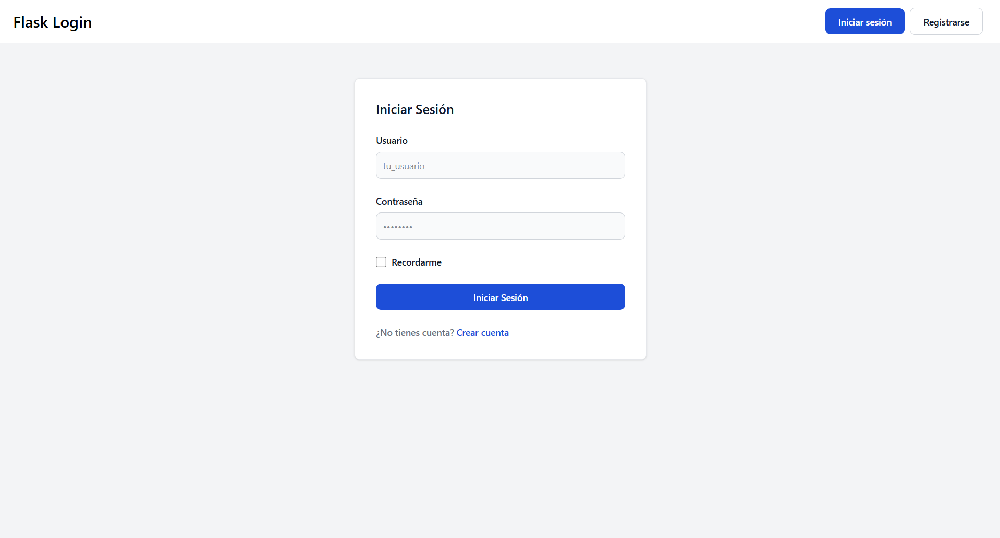
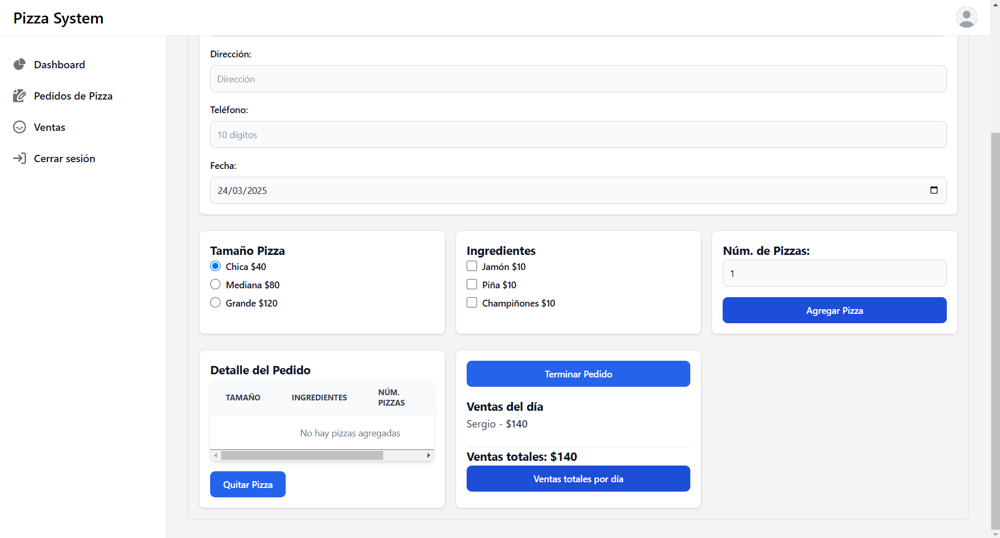
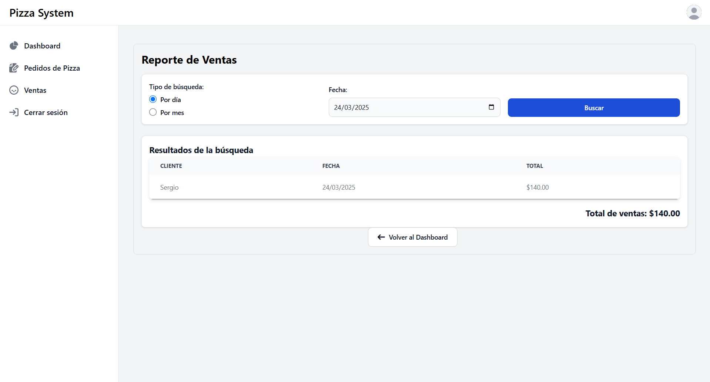

# Sistema de Autenticación con Flask-Login y Gestión de Pedidos

Este proyecto implementa un sistema de autenticación completo utilizando Flask-Login y un sistema de gestión de pedidos de pizza, todo presentado con una interfaz moderna gracias a Tailwind CSS y Flowbite.



## Características

- ✅ Sistema de registro de usuarios
- 🔐 Autenticación segura
- 🛡️ Protección de rutas con `login_required`
- 🔄 Funcionalidad "Recordarme"
- 🍕 Sistema integrado de pedidos de pizza
- 📊 Reportes de ventas por día y mes
- 📱 Diseño responsive con Tailwind CSS
- 🧩 Componentes interactivos con Flowbite

## Investigación: Flask-Login

### ¿Para qué sirve Flask-Login?

Flask-Login es una extensión para Flask que proporciona gestión de sesiones de usuario para aplicaciones web. Facilita tareas comunes como:

- Almacenar el ID del usuario activo en la sesión de Flask
- Cerrar sesión de usuarios
- Restringir vistas a usuarios autenticados o no autenticados
- Manejar la funcionalidad "recordarme" para sesiones prolongadas
- Proteger las sesiones de los usuarios contra robos de cookies

Flask-Login no impone un método específico de almacenamiento de datos ni restringe a usar nombres de usuario y contraseñas, permitiendo flexibilidad en la implementación.

### ¿Cómo se implementa Flask-Login en Flask?

1. **Instalación**: `pip install flask-login`

2. **Configuración básica**:
   ```python
   from flask_login import LoginManager
   
   login_manager = LoginManager()
   login_manager.init_app(app)
   login_manager.login_view = 'login'  # Página a la que redirigir si no hay sesión
   ```

3. **Implementación de la clase User**:
   ```python
   from flask_login import UserMixin
   
   class User(db.Model, UserMixin):
       id = db.Column(db.Integer, primary_key=True)
       username = db.Column(db.String(80), unique=True, nullable=False)
       password_hash = db.Column(db.Text)
       
       def set_password(self, password):
           self.password_hash = generate_password_hash(password)
           
       def check_password(self, password):
           return check_password_hash(self.password_hash, password)
   ```

4. **Definición del user_loader**:
   ```python
   @login_manager.user_loader
   def load_user(user_id):
       return User.query.get(int(user_id))
   ```

### ¿Cómo se protegen las rutas con Flask-Login?

Flask-Login proporciona el decorador `login_required` que protege las rutas para que solo puedan ser accedidas por usuarios autenticados:

```python
from flask_login import login_required, current_user

@app.route('/dashboard')
@login_required
def dashboard():
    return render_template('dashboard.html')
```

Si un usuario no autenticado intenta acceder a esta ruta, será redirigido automáticamente a la vista definida en `login_manager.login_view`, generalmente una página de inicio de sesión.

## Sistema de Gestión de Pedidos de Pizza

Este proyecto incluye un sistema completo de gestión de pedidos de pizza con las siguientes funcionalidades:

- Registro de datos del cliente (nombre, dirección, teléfono)
- Selección de tamaño de pizza (Chica, Mediana, Grande)
- Selección de ingredientes (Jamón, Piña, Champiñones)
- Cálculo automático de precios según tamaño e ingredientes
- Gestión de múltiples pizzas por pedido
- Visualización de ventas del día
- Generación de reportes de ventas por día o mes

## Tecnologías utilizadas

- **Flask**: Framework web ligero para Python
- **Flask-Login**: Extensión para manejo de sesiones de usuario
- **SQLAlchemy**: ORM para interacción con la base de datos
- **Tailwind CSS**: Framework CSS para diseño moderno
- **Flowbite**: Biblioteca de componentes basada en Tailwind CSS
- **MySQL**: Sistema de gestión de base de datos relacional

## Configuración del proyecto

### Requisitos previos

- Python 3.7+
- MySQL
- Node.js y npm (para Tailwind CSS y Flowbite)

### Instalación

1. **Clonar el repositorio**

   ```bash
   git clone https://github.com/IDGS-803-22001409/partial3_VazquezRizo.git
   cd partial3_VazquezRizo
   ```

2. **Crear un entorno virtual**

   ```bash
   python -m venv env
   
   # En Windows
   env\Scripts\activate
   
   # En macOS/Linux
   source env/bin/activate
   ```

3. **Instalar dependencias de Python**

   ```bash
   pip install -r requerimientos.txt
   ```

4. **Instalar dependencias de Node.js**

   ```bash
   npm install tailwindcss flowbite
   ```

5. **Configurar la base de datos**

   Crea una base de datos MySQL llamada `flaskBDLogin` y ajusta la configuración de conexión en `config.py` si es necesario.

6. **Generar CSS con Tailwind**

   ```bash
   npx tailwindcss -i ./static/src/input.css -o ./static/src/output.css --watch
   ```

### Ejecución del proyecto

1. **Iniciar la aplicación**

   ```bash
   python app.py
   ```

2. **Acceder a la aplicación**

   Abre tu navegador y visita `http://127.0.0.1:5000`

## Estructura del proyecto

```
flask-login/
│
├── app.py                 # Archivo principal de la aplicación
├── config.py              # Configuración de la aplicación
├── models.py              # Modelos de datos (usuarios, clientes, pedidos)
├── forms.py               # Formularios para login, registro y pedidos
├── static/
│   ├── src/
│   │   ├── input.css      # Archivo CSS de entrada para Tailwind
│   │   └── output.css     # Archivo CSS generado por Tailwind
│   └── node_modules/      # Dependencias de JavaScript
└── templates/
    ├── base.html          # Plantilla base
    ├── login.html         # Página de login
    ├── register.html      # Página de registro
    ├── dashboard.html     # Página principal después del login
    ├── pedidos.html       # Sistema de pedidos de pizza
    └── ventas.html        # Reportes de ventas
```

## Capturas de pantalla

### Página de Login


### Página de Registro


### Dashboard


### Sistema de Pedidos


### Reporte de Ventas


## Contribuciones

Este proyecto fue creado como parte de un ejercicio académico. 

## Autor

Sergio Esteban Vázquez Rizo - [checoevr@gmail.com](mailto:checoevr@gmail.com)

---

👨‍💻 Desarrollado como parte del curso de Desarrollo Web con Python